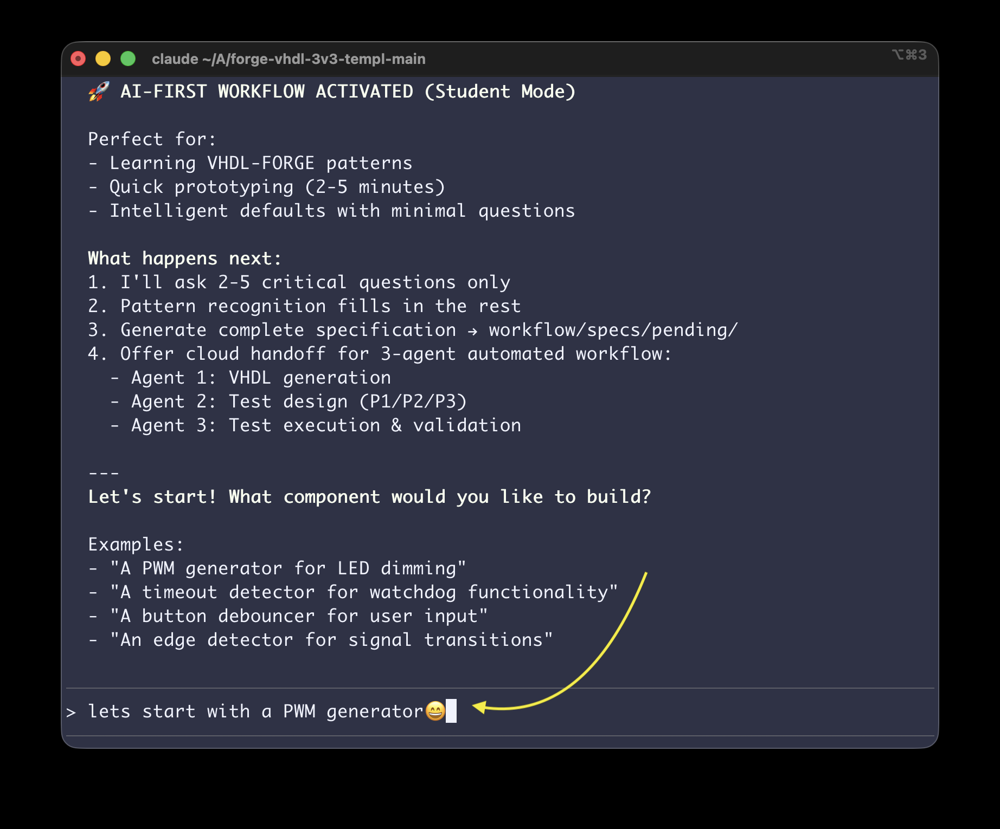

# 🚀 forge-vhdl: AI-Powered VHDL Development in Minutes

**Build tested VHDL components in 2-5 minutes with AI agents.**

[](../../generate)

---

## 🎬 See It In Action

**Watch the complete workflow in 3 minutes:**

[](https://asciinema.org/a/O7T8zh2OPdbqEMX84TjfNnu9p)

**What you'll see:**
- 💻 Interactive requirements gathering (2 questions, 30 seconds)
- 🤖 AI agent generating VHDL specification
- ✅ Complete component ready for cloud execution
- 📦 From idea to specification in under 3 minutes

**[▶️ Click to watch the recording](https://asciinema.org/a/O7T8zh2OPdbqEMX84TjfNnu9p)**

---

## ⚡ Quick Start

```bash
/forge-start
```



**That's it!** Answer 2-5 questions → Get tested VHDL → Done in minutes.

---

## 🔄 Two Workflows

### 🚀 AI-First (DEFAULT - 2-5 Minutes)

**Best for:** Students, quick prototyping, learning

```
/forge-start
> Choose: AI-First Workflow
> Answer: 2-3 critical questions
> Claude infers everything else from patterns
> Get: Tested VHDL component
```

**Time:** 2-5 minutes
**Guide:** `workflow/AI_FIRST_REQUIREMENTS.md`

### 🔧 Engineer (Advanced - 15-30 Minutes)

**Best for:** Complex systems, full control, detailed specs

```
/forge-start
> Choose: Engineer Workflow
> Answer: 30-question structured interview
> Full specification with all details
> Get: Production-ready component
```

**Time:** 15-30 minutes
**Guide:** `workflow/ENGINEER_REQUIREMENTS.md`

---

## 📄 License & Info

**License:** MIT License - See `LICENSE` file

**Version:** 3.2.0
**Template:** https://github.com/vmars-20/forge-vhdl-3v3-vmars
**Your Repository:** 🔧 **UPDATE THIS** → `https://github.com/YOUR-USERNAME/YOUR-REPO-NAME`
**Last Updated:** 2025-11-09
**Maintainer:** Moku Instrument Forge Team
