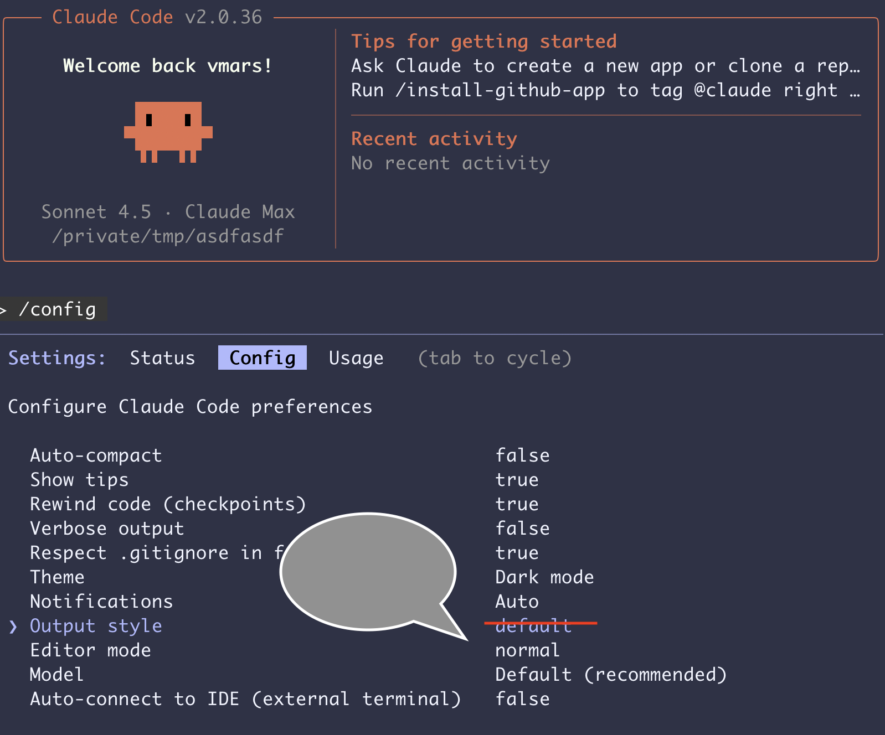

# forge-vhdl Onboarding Guide

**Version:** 1.0
**Purpose:** Guide new users through the S0-S3 setup workflow
**Audience:** Students, engineers forking the template repository

---

## Overview

This guide walks you through the **first-time setup** for forge-vhdl, from forking the template repository to running your first VHDL component with tests.

**Timeline:** 5-10 minutes for full setup

---

## The S0-S3 Workflow

### S0: Fork Template Repository (GitHub)

**Goal:** Create your own copy of forge-vhdl from the template

**Steps:**

1. Navigate to the forge-vhdl template repository on GitHub
2. Click **"Use this template"** → **"Create a new repository"**
3. Name your repository (e.g., `my-vhdl-project`)
4. Choose visibility (public or private)
5. Click **"Create repository from template"**

**Result:** You now have `https://github.com/[your-username]/my-vhdl-project`

---

### S1: Clone Repository Locally

**Goal:** Get the repository on your machine

**Steps:**

```bash
# Clone your fork
git clone https://github.com/[your-username]/my-vhdl-project
cd my-vhdl-project
```

**Result:** Repository is now on your local machine

---

### S2: Bootstrap Python Environment

**Goal:** Install Python dependencies (no GHDL requirement yet)

**Steps:**

```bash
# Install dependencies using uv
uv sync
```

**What happens:**
- Creates Python virtual environment (`.venv/`)
- Installs CocoTB, forge-python utilities
- Downloads dependencies from `pyproject.toml`
- **Does NOT require GHDL** (that comes next)

**Result:** Python environment ready, `uv` commands work

**Time:** 30-60 seconds

---

### S3: Launch Claude and Detect Environment

**Goal:** Claude auto-detects your environment (local CLI vs cloud) and guides you through final setup

**Steps:**

```bash
# Launch Claude Code CLI
claude
```

**What Claude does automatically:**

1. **Detects runtime environment:**
   - 💻 Local: Claude Code CLI on your machine
   - 🌐 Cloud: Claude Code Web, Codespaces, containers

2. **Checks GHDL installation:**
   - ✅ Found: Ready for VHDL simulation
   - ⚠️ Not found: Guides you through installation

3. **Displays environment-specific welcome message:**

**Local environment (most common):**
```
╔════════════════════════════════════════════════════════════════════╗
║  💻 LOCAL ENVIRONMENT DETECTED (Claude Code CLI)                   ║
║  ✅ GHDL Found: GHDL X.X.X (gcc backend)                           ║
║                                                                    ║
║  Before we start, please verify your output settings:             ║
║                                                                    ║
║  1. Run: /config                                                   ║
║  2. Navigate to "Config" tab                                       ║
║  3. Check these settings:                                          ║
║     • Verbose output: false (RECOMMENDED for clean logs)           ║
║     • Output style: default (RECOMMENDED)                          ║
║     • Auto-compact: false (RECOMMENDED for VHDL test output)       ║
║                                                                    ║
║  Reference screenshot: static/Claude-CLI-output-settings.png       ║
║                                                                    ║
║  ✓ Ready for AI-First requirements gathering workflow!            ║
║  ✓ Interactive mode enabled (default for students/beginners)      ║
╚════════════════════════════════════════════════════════════════════╝

Loading local-optimized CLAUDE.md instructions...
```

**Cloud environment:**
```
╔════════════════════════════════════════════════════════════════════╗
║  🌐 CLOUD ENVIRONMENT DETECTED                                     ║
║  ✅ GHDL Found: GHDL X.X.X (pre-installed)                         ║
║                                                                    ║
║  Ready for VHDL development! Using cloud workflow.                 ║
╚════════════════════════════════════════════════════════════════════╝

Loading cloud-optimized CLAUDE.md instructions...
```

4. **Loads environment-specific guide:**
   - Local → `.claude/CLAUDE_LOCAL.md`
   - Cloud → `.claude/CLAUDE_CLOUD.md`

**Result:** Claude knows your environment and is ready to help!

---

## Post-Setup: Verify Your Configuration

### For Local Environments (Claude Code CLI)

**CRITICAL: Check your output settings**

Claude's default verbosity can make VHDL test logs hard to read. Here's how to optimize:

1. **Open config screen:**
   ```
   /config
   ```

2. **Navigate to "Config" tab** (use tab key to cycle)

3. **Verify these settings:**

   | Setting | Recommended Value | Why |
   |---------|-------------------|-----|
   | Verbose output | `false` | Prevents duplicate/verbose logs |
   | Output style | `default` | Best for test output formatting |
   | Auto-compact | `false` | Preserves VHDL test context |
   | Rewind code | `true` | Helpful for iterative debugging |

4. **Reference screenshot:** See `static/Claude-CLI-output-settings.png`

   

5. **After verifying, close config:** Press `Esc` or navigate away

**Why this matters:**
- VHDL test output can be verbose (hundreds of lines)
- Incorrect settings = hard-to-read logs
- forge-vhdl aims for <20 line P1 test output (LLM-optimized)
- Verbose mode would defeat this optimization

---

### For Cloud Environments (Claude Code Web / Codespaces)

**GHDL is pre-installed and validated** - no additional configuration needed!

If you see "GHDL not found" (rare), Claude will automatically run:
```bash
uv run python scripts/cloud_setup_with_ghdl.py
```

This takes ~2-3 minutes and installs GHDL + dependencies.

---

## Install GHDL (If Not Found)

### Local Environments

**macOS:**
```bash
brew install ghdl
```

**Ubuntu/Debian:**
```bash
sudo apt-get update
sudo apt-get install ghdl ghdl-llvm
```

**Verify installation:**
```bash
ghdl --version
```

Expected output:
```
GHDL 4.x.x (gcc backend) [or similar]
```

**After installing, restart Claude session:**
```bash
# Exit Claude
exit

# Restart
claude
```

Claude will re-detect your environment and confirm GHDL is now available.

---

### Cloud Environments (DevContainer)

**GHDL is pre-installed via DevContainer configuration - no action needed!**

**What DevContainer does automatically:**

1. **Uses GHDL base image:** `ghdl/ghdl:ubuntu22-llvm-5.0`
   - GHDL 5.0 with LLVM backend already installed
   - Ubuntu 22.04 base

2. **Runs setup on container creation:**
   ```bash
   uv run python scripts/cloud_setup_with_ghdl.py
   ```
   - Installs LLVM 18
   - Creates library symlinks
   - Validates GHDL with sample simulation

3. **Displays confirmation:**
   ```
   ✅ VHDL-FORGE 3.0 Ready! Run: uv run python cocotb_tests/run.py --list
   ```

**Time:** Container creation ~1-2 minutes (automatic)

**If GHDL somehow missing (rare):**
Claude will automatically run the setup script again.

**GitHub Codespaces users:**
Click "Code" → "Create codespace" - everything installs automatically!

---

## Your First Component

Now that you're set up, let's create your first VHDL component!

### Quick Start (AI-First Workflow)

**Step 1: Tell Claude what you need**

```
"I need a PWM generator with configurable duty cycle. Use the AI-First requirements workflow."
```

**Step 2: Answer 2-3 critical questions**

Claude will ask:
- What frequency range? (e.g., 1 kHz - 100 kHz)
- Duty cycle resolution? (e.g., 8-bit = 0-255)
- Any special timing constraints?

**Step 3: Review proposed specification**

Claude uses pattern recognition to infer:
- Port names and types (from similar components)
- Standard VHDL-2008 coding patterns
- Progressive test strategy (P1/P2/P3)
- Reset behavior and clock requirements

**Step 4: Approve and launch automated workflow**

Claude will:
1. Generate specification: `workflow/specs/pending/forge_util_pwm.md`
2. Invoke Agent 1: `forge-vhdl-component-generator` → VHDL code
3. Invoke Agent 2: `cocotb-progressive-test-designer` → Test architecture
4. Invoke Agent 3: `cocotb-progressive-test-runner` → Working tests

**Step 5: Review artifacts**

Outputs appear in `workflow/artifacts/`:
```
workflow/artifacts/
├── vhdl/forge_util_pwm.vhd
└── tests/test_forge_util_pwm_progressive.py
```

**Step 6: Run tests**

```bash
# Move artifacts to main codebase
mv workflow/artifacts/vhdl/forge_util_pwm.vhd vhdl/utilities/
mv workflow/artifacts/tests/test_forge_util_pwm_progressive.py cocotb_tests/components/

# Run P1 tests
uv run python cocotb_tests/run.py forge_util_pwm
```

**Expected output (P1 tests):**
```
Running P1 tests for forge_util_pwm...

✅ PASS: Reset test
✅ PASS: Duty cycle 0%
✅ PASS: Duty cycle 50%
✅ PASS: Duty cycle 100%
✅ PASS: Enable control

5/5 tests passed (0.9s)
```

**Golden rule:** P1 output should be <20 lines!

---

## What Just Happened?

Let's recap the magic:

### Environment Detection

Claude ran `.claude/env_detect.py` to determine:
- Runtime environment (local CLI vs cloud)
- GHDL availability
- Recommended workflow

### Workflow Selection

Based on your environment, Claude loaded the appropriate guide:
- **Local:** `.claude/CLAUDE_LOCAL.md` (interactive, output config reminders)
- **Cloud:** `.claude/CLAUDE_CLOUD.md` (streamlined, GHDL auto-install)

### Requirements Gathering

Claude used the **AI-First workflow** (default for students):
- 2-3 critical questions only
- Pattern recognition to fill in the rest
- Generated complete specification in 2-5 minutes

### Automated 3-Agent Workflow

1. **Agent 1** (Component Generator): VHDL entity/architecture
2. **Agent 2** (Test Designer): Test architecture + strategy
3. **Agent 3** (Test Runner): Working tests + execution results

### Progressive Testing

Tests follow the P1/P2/P3 standard:
- **P1** (default): 2-4 essential tests, <20 line output, <5 sec runtime
- **P2**: 5-10 tests with edge cases, <50 line output, <30 sec runtime
- **P3**: 15-25 comprehensive tests, <100 line output, <2 min runtime

---

## Next Steps

Now that you're set up, explore more:

### Learn by Example

Browse the reference specifications:
```bash
ls workflow/specs/reference/
```

You'll find 5 gold-standard examples:
- `edge_detector.md` - Simple utility pattern
- `synchronizer.md` - Clock domain crossing (CDC)
- `pwm_generator.md` - Counter-based pattern
- `debouncer.md` - FSM pattern with timing
- `pulse_stretcher.md` - Retriggerable timing pattern

**Use them:**
```
"Read workflow/specs/reference/edge_detector.md and execute the complete 3-agent workflow"
```

### Try the Engineer Workflow

For detailed control and learning VHDL standards in depth:
```
"I want to create a new VHDL component. Please read workflow/ENGINEER_REQUIREMENTS.md
and guide me through the requirements process."
```

This triggers a 30-question Q&A covering:
- Component identification
- Detailed functionality
- Complete interface specification
- Behavior/FSM states
- Testing strategy
- Design constraints

Takes 15-30 minutes, produces highly detailed specification.

### Explore Existing Components

See what's already implemented:
```bash
# View component catalog
cat llms.txt

# List existing components
ls vhdl/utilities/
ls vhdl/packages/
ls vhdl/debugging/

# Run existing tests
uv run python cocotb_tests/run.py --list
uv run python cocotb_tests/run.py forge_util_clk_divider
```

### Read the Coding Standards

Learn the VHDL-2008 + forge-vhdl conventions:
```bash
# Quick reference (templates + checklists)
cat docs/VHDL_QUICK_REF.md

# Complete style guide (600 lines)
cat docs/VHDL_CODING_STANDARDS.md
```

**Key standards:**
- FSM states: Use `std_logic_vector`, NOT enums (Verilog compatibility)
- Port order: clk, rst_n, clk_en, enable, data, status
- Signal naming: `ctrl_`, `cfg_`, `stat_`, `dbg_` prefixes
- Reset hierarchy: rst_n > clk_en > enable

---

## Troubleshooting

### "Environment detection not working"

**Manual check:**
```bash
uv run python .claude/env_detect.py
```

**Expected output:**
```
Runtime Environment: local  (or "cloud")
GHDL Installed: True
GHDL Version: GHDL X.X.X

Recommended workflow: CLAUDE_LOCAL.md  (or CLAUDE_CLOUD.md)

╔════════════════════════════════════════════════════════════════════╗
║  💻 LOCAL ENVIRONMENT DETECTED (Claude Code CLI)                   ║
║  ...                                                               ║
╚════════════════════════════════════════════════════════════════════╝
```

### "GHDL not found"

**Local:**
```bash
# macOS
brew install ghdl

# Ubuntu/Debian
sudo apt-get install ghdl ghdl-llvm
```

**Cloud:**
```bash
# Auto-install
uv run python scripts/cloud_setup_with_ghdl.py
```

### "Test output too verbose"

**Check:**
1. `GHDL_FILTER_LEVEL` should be `aggressive` (default for P1)
2. `TEST_LEVEL` should be `P1_BASIC` (or unset)
3. Review test design: Are you running too many iterations?

**See:** `docs/PROGRESSIVE_TESTING_GUIDE.md` for details

### "CocoTB can't access VHDL signal"

**Error:**
```
AttributeError: 'HierarchyObject' object has no attribute 'value'
```

**Cause:** Using `real`, `boolean`, `time`, or custom records in entity ports

**Solution:** Use test wrapper with `std_logic_vector` / `signed` / `unsigned` only

**See:** `docs/COCOTB_TROUBLESHOOTING.md` Section 0

---

## Summary

**S0:** Fork template repository on GitHub
**S1:** Clone repository locally
**S2:** Bootstrap Python environment (`uv sync`)
**S3:** Launch Claude → Auto-detect environment → Load appropriate guide

**Result:** Ready to create VHDL components with AI-assisted workflow!

**Time:** 5-10 minutes total

**Next:** Try your first component with AI-First workflow

---

**Quick Links:**
- [Main Guide (Router)](../CLAUDE.md)
- [Local Development Guide](../.claude/CLAUDE_LOCAL.md)
- [Cloud Development Guide](../.claude/CLAUDE_CLOUD.md)
- [Component Catalog](../llms.txt)
- [Reference Specifications](../workflow/specs/reference/)

**Last Updated:** 2025-11-09
**Version:** 1.0
